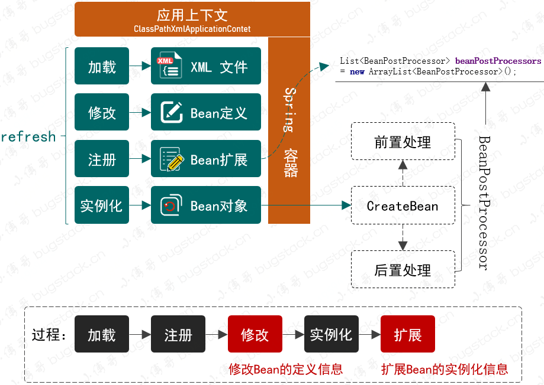
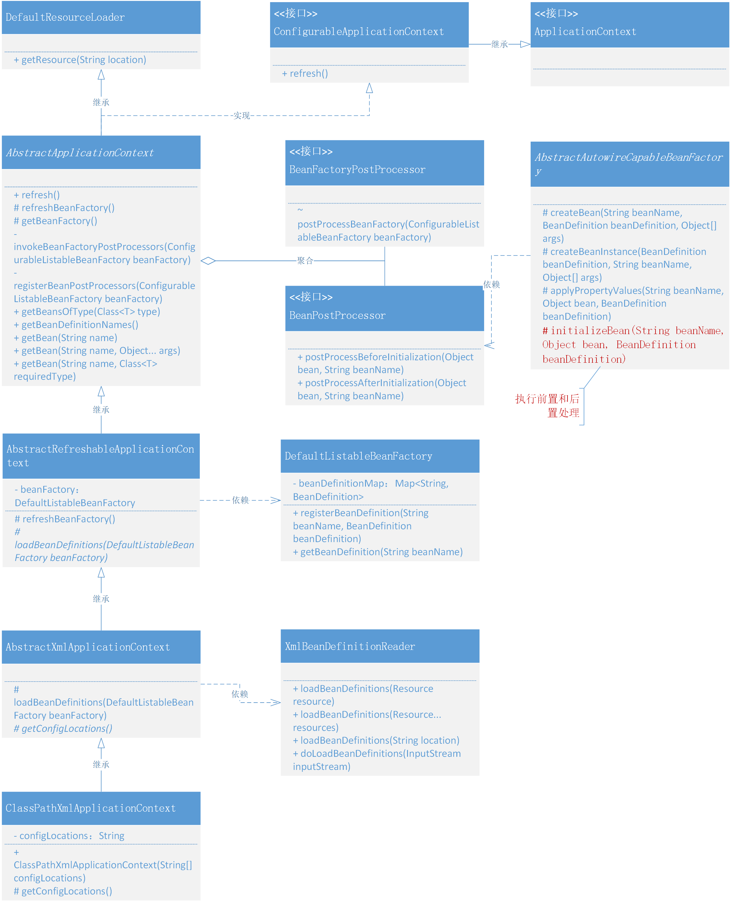

## Day02 实现 Bean 的定义、注册、获取

当一个 Bean 对象被定义存放以后，再由 Spring 统一进行装配，这个过程包括 Bean 的初始化、属性填充等，最终我们就可以完整的使用一个
Bean 实例化后的对象了。

Bean 的定义、注册、获取三个基本步骤

我们在把系统设计的视角聚焦到具体代码实现上，你会有什么手段来实现你想要的设计模式呢？其实编码方式主要依托于：接口定义、类实现接口、抽象类实现接口、继承类、继承抽象类，而这些操作方式可以很好的隔离开每个类的基础功能、通用功能和业务功能，当类的职责清晰后，你的整个设计也会变得容易扩展和迭代。

非常重要的一点是在 Bean 注册的时候只注册一个类信息，而不会直接把实例化信息注册到 Spring 容器中。
在获取 Bean 对象时需要处理 Bean 对象的实例化操作以及判断当前单例对象在容器中是否已经缓存起来了。

## Day06 实现应用上下文，自动识别、资源加载、扩展机制

现在需要提供出一个可以在 Bean 初始化过程中，完成对 Bean 对象的扩展时，就很难做到自动化处理。所以我们要把 Bean 对象扩展机制功能和对
Spring 框架上下文的包装融合起来，对外提供完整的服务。

为了能满足于在 Bean 对象从注册到实例化的过程中执行用户的自定义操作，就需要在 Bean
的定义和初始化过程中插入接口类，这个接口再有外部去实现自己需要的服务。那么在结合对 Spring
框架上下文的处理能力，就可以满足我们的目标需求了。整体设计结构如下图：

- 满足于对 Bean 对象扩展的两个接口，其实也是 Spring 框架中非常具有重量级的两个接口：`BeanFactoryPostProcessor`
  和 `BeanPostProcessor`，也几乎是大家在使用 Spring 框架额外新增开发自己组建需求的两个必备接口。
- BeanFactoryPostProcessor，是由 Spring 框架组建提供的容器扩展机制，允许在 Bean 对象注册后但未实例化之前，对 Bean
  的定义信息 `BeanDefinition` 执行修改操作。
- BeanPostProcessor，也是 Spring 提供的扩展机制，不过 BeanPostProcessor 是在 Bean 对象实例化之后修改 Bean 对象，也可以替换
  Bean 对象。这部分与后面要实现的 AOP 有着密切的关系。
- 同时如果只是添加这两个接口，不做任何包装，那么对于使用者来说还是非常麻烦的。我们希望于开发 Spring 的上下文操作类，把相应的
  XML 加载 、注册、实例化以及新增的修改和扩展都融合进去，让 Spring 可以自动扫描到我们的新增服务，便于用户使用。

